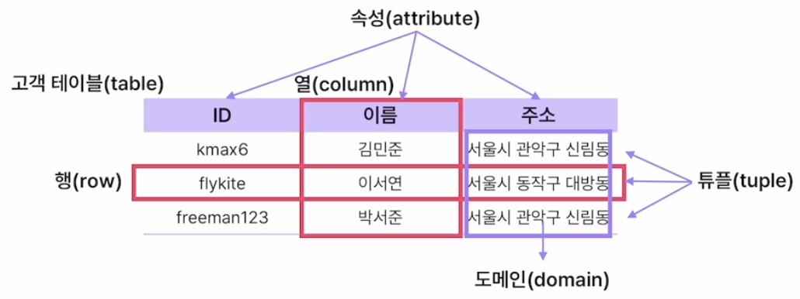

# ****04주차. Database I (01/15)****

## **01 데이터베이스 개요**

- 데이터 : 현실 세계에서 수집된 단순한 사실과 값
- 정보 : 특정 목적에 의해 해석하거나 가공한 데이터
- 데이터베이스 : 공동으로 사용하는 데이터들을 통합하여 저장하고 운영하는 데이터

- **파일처리 시스템의 한계**
    - 데이터의 구조 바뀌면 응용 프로그램 구조도 바뀌어여 함 (데이터 종속 문제)
    - 데이터 중복 문제
    - 데이터 무결성 지킬 수 없음
        - 무결성 : 데이터를 정확하고 일관된 형태로 유지 (안정적)
- **데이터베이스의 특징**
    - 실시간 접근성 : 사용자가 원할 때 언제든지 접근 가능
    - 지속적인 변화 : 데이터의 삽입, 삭제, 갱신을 통해 최신 데이터 유지
    - 동시 공유 : 여러 사용자가 동시에 이용 가능
    - 내용에 대한 참조 : 물리적 위치가 아닌 값을 가지고 검색 가능
        
        
- **데이터베이스 종류**
    - RDB(Relational DB) : 관계형 모델 기반, SQL 이용
    - NoSQL(Not only SQL) : 데이터 관계 정의 X, 유연성
- **관계형 데이터베이스(RDB)**
    - 행, 열을 가지는 테이블로 표현
    - 테이블 간 관계를 이용해 데이터 무결성 보장
    - 정의된 테이블(스키마)에 맞게 데이터 삽입. 데이터 안정성 보장
    - 일관적인 데이터 구조에 주로 사용
    - MySQL, MariaDB 등
- **NoSQL**
    - 저장 데이터의 유형 제한 없음
    - 새로운 유형 데이터 추가 용이
    - 일관적이지 않은 데이터 구조, 자주 변경되는 경우 적합
    - 대용량 데이터 빠르게 처리 가능
    - MongoDB, Redis 등
    
- **관계형 데이터베이스 구성 요소**
    - 테이블 : 행과 열로 구성
    - 속성 : 데이터의 특성을 나타내는 가장 작은 논리적 단위
    - 튜플 : 속성이 모여 구성된 각각의 행
    - 도메인 : 속성이 가질 수 있는 값의 집합(중복 제외)
    
    
    
    - 주소 도메인의 개수 : 2개 / 튜플의 개수 : 3개
    
- **테이블 정의하기**
    
    ```sql
    CREATE TABLE customer (
    	id VARCHAR(10),
    	name VARCHAR(10),
    	address VARCHAR(30)
    );
    ```
    
    - `SHOW TABLES;` : DB의 테이블 목록 확인
    - `DESC customer;` : 테이블 구조 확인
- **데이터 삽입하기**
    
    ```sql
    INSERT INTO customer (id, name, address)
    VALUES('kmax6', '김민준', '서울시 관악구 신림동');
    
    -- 속성 목록을 지정해준다면 데이터 순서는 상관 없음
    -- 모든 속성을 순서대로 입력하는 경우 속성 목록 생략 가능
    ```
    
- **데이터 출력하기**
    
    ```sql
    SELECT id, name, address FROM customer;
    
    SELECT address, name FROM customer; -- 원하는 속성
    
    SELECT * FROM customer; -- 모든 속성
    ```
    

- **SQL (Structured Query Language)**
    - 관계형 DB를 활용하기 위해 사용하는 표준 언어
    - 데이터 정의어 (DDL) : 테이블과 같은 데이터 구조 정의
    - 데이터 조작어 (DML) : 데이터 조회 및 검색
    - 데이터 제어어 (DCL) : DB 접근 권한 관리
    
- **데이터 정의어 (DDL)**
- **테이블 정의하기 (CREATE)**
    
    ```sql
    CREATE TABLE customer (
    	id VARCHAR(10) NOT NULL, -- 제약 조건
    	name VARCHAR(10) NOT NULL,
    	address VARCHAR(30) NULL 
    );
    ```
    
    - 데이터 타입
        - VARCHAR(n) / INT / FLOAT / DATETIME
- **테이블 수정하기 (ALTER)**
    
    ```sql
    -- 컬럼 추가
    ALTER TABLE customer ADD COLUMN birthday DATE NULL;
    -- 컬럼 수정
    ALTER TABLE customer MODIFY COLUMN id VARCHAR(15) NULL;
    -- 컬럼 이름 변경
    ALTER TABLE customer CHANGE COLUMN name korean_name VARCHAR(10) NOT NULL;
    -- 컬럼 삭제
    ALTER TABLE customer DROP COLUMN address;
    -- 테이블 이름 변경
    ALTER TABLE customer RENAME member;
    ```
    
- **테이블 삭제하기 (DROP)**
    
    ```sql
    DROP TABLE member;
    ```
    

## ****02 데이터베이스 구성하기****

- **제약 조건**
    - `NOT NULL`
    - `UNIQUE` (중복 비허용)
    - `DEFAULT ‘no Address’` (기본값 설정)
    - `CHECK (age ≥ 19)` (값 범위 제한)
    - `CONSTRAINT` (제약 조건 정의)
        
        ```sql
        CONSTRAINT id_unique UNIQUE (id),
        CONSTRAINT age_check CHECK (age >= 19)
        ```
        
    - 제약 조건 추가
        
        ```sql
        ALTER TABLE customer
        ADD CONSTRAINT id_unique UNIQUE (id);
        
        ALTER TABLE customer
        CONSTRAINT age_check CHECK (age >= 19); 
        
        ALTER TABLE customer
        ALTER address SET DEFAULT '주소 없음';
        ```
        
    - 제약 조건 삭제
        
        ```sql
        ALTER TABLE customer DROP CONSTRAINT id_unique;
        
        ALTER TABLE customer
        ALTER address DROP DEFAULT;
        ```
        

- **키 (KEY)**
    - 기본키 : 튜플을 유일하게 식별할 수 있는 기준이 되는 속성
        - 중복 값 & NULL 비허용
        - 테이블 당 1개 설정
        - `PRIMARY KEY`
    - 외래키 : 다른 테이블의 기본키를 참조하는 속성
        - `FOREIGN KEY (참조할 속성) REFERENCES 참조될 테이블(참조되는 속성)`
    - 후보키 : 기본키가 될 수 있는 키. 유일성 & 최소성 만족
    - 대체키 : 후보키 중 기본키가 아닌 키
    - 슈퍼키 : 유일성은 만족하지만 최소성은 만족하지 않는 키
    (속성 두 개로 구분하는 경우)
    
- **데이터 모델링**
    - 현실 세계에 존재하는 데이터를 DB화하는 과정
- **데이터 모델의 구성 요소**
    - 개체 (Entity) : 현실 개념이나 정보의 단위 (ex : 킥보드, 회원)
    - 속성 (Attribute) : 개체의 정보 (ex : 브랜드, 가격, 이름)
    - 관계 (Relationship) : 개체 간 연관성 (ex : 대여)
- **데이터 모델링 과정**
    - 개념적 설계 : 현실 세계 → 추상적 개념
    - 논리적 설계 : 데이터 구조(스키마) 설계
    - 물리적 설계 : DB에 저장할 테이블 구조 설계
    
- **ERD (Entity-Relationship Diagram)**
    - 현실 데이터를 개체-관계 형태의 다이어그램으로 나타냄
- **ER 다이어그램 (Peter Chen)**
    
    
    
    - 관계 추가하기
        
        
        
        - N : M 관계는 각 개체의 기본키를 외래키로 가짐
- **ER 다이어그램 (IE)**
    
    
    
    - 까마귀발 표기법
        
        
        
        - N : M 관계는 각 개체의 기본키를 외래키로 가짐
        

## ****03 데이터 모델링****

- **이상 현상과 정규화**
    - 이상 현상
        - 삽입 이상 : 주문하지 않은 고객의 데이터 삽입 불가
        - 갱신 이상 : 고객의 주소를 수정하면 모든 튜플에서 갱신 필요
        - 삭제 이상 : 회원의 주문 기록을 삭제하면 회원의 데이터도 삭제됨
    - 정규화
        - 이상 현상을 제거하기 위해 DB 구조화
        - 데이터 간 종속성 제거 → 중복 데이터 최소화
        - 데이터 일관성 & 무결성 보장
        - 1차 / 2차 / 3차 / 보이스코드 / 4차 / 5차 정규화
- **1차 정규화**
    - 테이블 컬럼이 하나의 값만 갖도록 도메인을 원자값으로 설정
- **2차 정규화**
    - 부분 함수 종속 : 기본키를 구성하는 속성 중 일부가 결정자 역할을 하는 경우 (복합키인 경우)
        - 결정자 : 다른 속성을 특정할 수 있는 속성
        - 종속자 : 결정자에 의해 특정되는 속성
    - 부분 함수 종속을 제거하고 완전 함수 종속이 되도록 테이블 분해
- **3차 정규화**
    - 이행 함수 종속 : A → B, B → C 관계에서 A → C가 성립하는 경우
    - 이행 함수 종속을 제거하도록 테이블 분해
- 정규화 정리